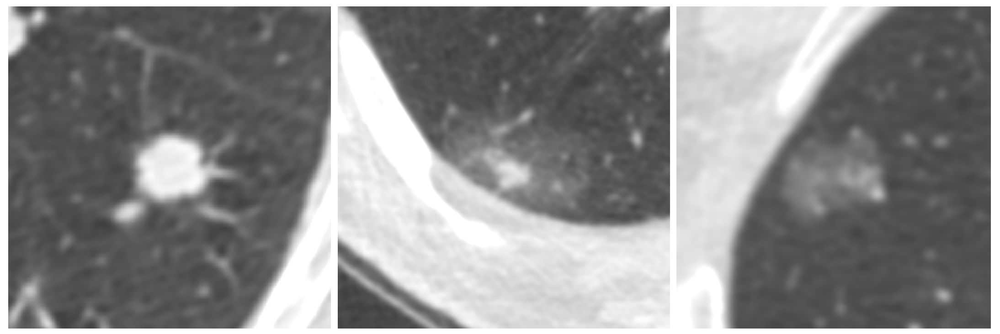
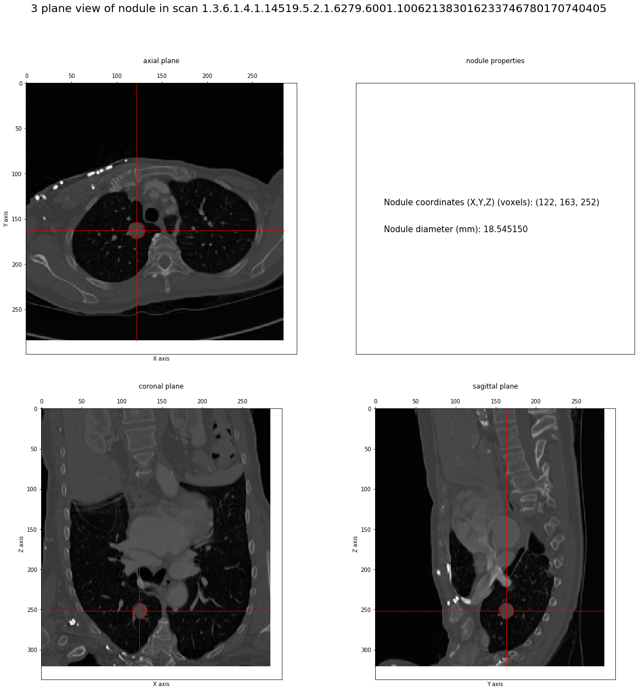
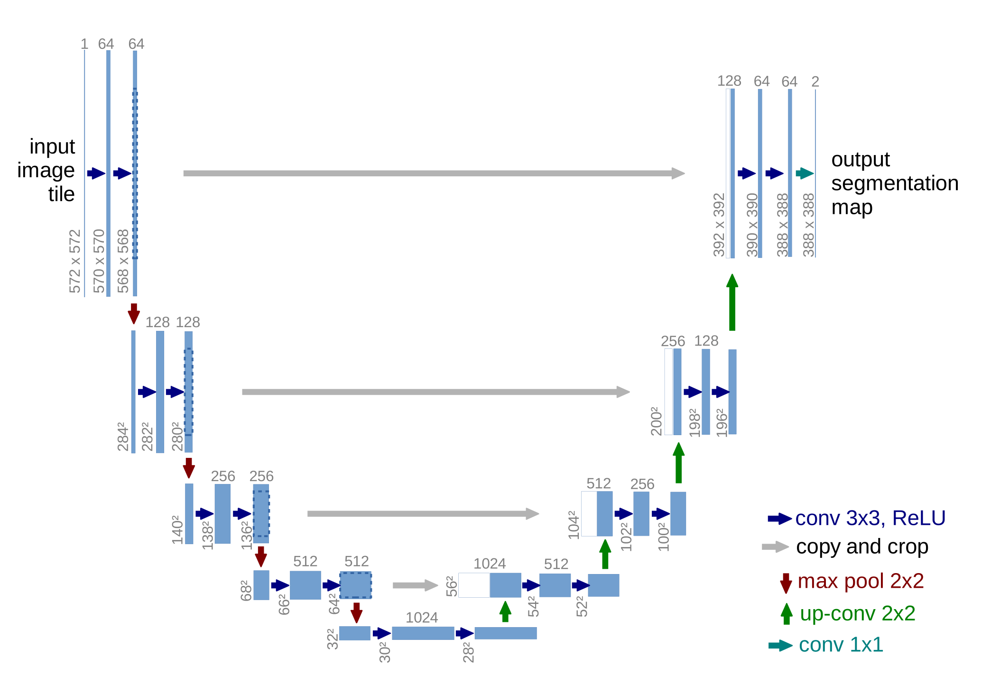
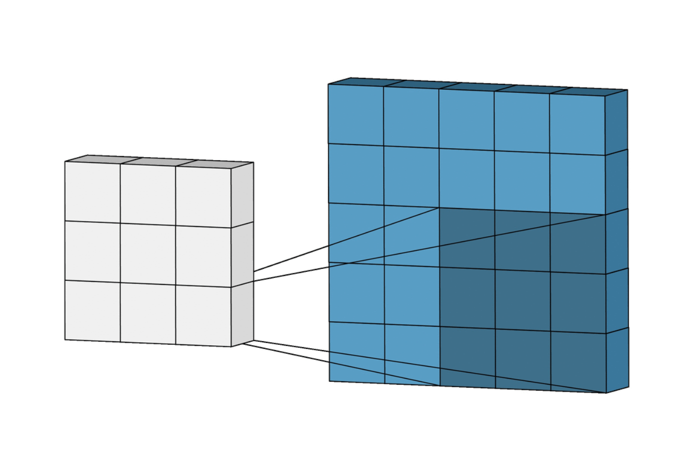

# Introduction
\setcounter{page}{1}
\pagenumbering{arabic}
\newpage

## Clinical context

### Lung cancer

Mention @Siegel2018 for the cancer statistics and initial paragraphs.

Lung cancer is the most deadly cancer in both men and women worldwide1. It is the second most common cancer in both men and women, trailing prostate cancer for men, and breast cancer for women1. In the Netherlands, more than 10,000 people die of lung cancer every year2. The Dutch Cancer Society estimates that lung cancer will account for 25% of all cancer-related deaths in 20152. In the United States, the American Cancer Society estimates a similar percentage for 2015: 27%1. Figure 1.1 shows the estimated number of new cancer cases and deaths in men and women in the United States in 2015.
The 5-year relative survival rate for all stages combined is only 17%1. This low
rate can be largely attributed to the fact that at present, only 15% of all lung cancers are diagnosed in an early stage1. The reason for this is that symptoms usually do not occur until the cancer is in an advanced stage. If lung cancer is detected in an early stage when the disease is still localized and more curative treatment options are available, the 5-year relative survival rate is 54%1. Therefore, early detection of lung cancer is of major importance to reduce lung cancer mortality.
By far the most important risk factor for lung cancer is tobacco use. The risk in-
creases both with quantity and duration of smoking. An estimated 87% of all lung cancer deaths are caused by cigarette smoking3. Therefore, complete banning of to- bacco use would be the best recipe to reduce lung cancer mortality. Although the risks of smoking are well-known, it remains a major cause of the increasing global burden of cancer. Other risk factors for lung cancer are exposure to asbestos, expo- sure to radon, and air pollution.

### Computed Tomography
Basically talk about the technique and how it has been changing diagnosis recently.

|       Substance       |      HU      |
| --------------------: | :----------- |
|                   Air | -1000        |
|                   Fat | -120 to -90  |
| Soft Tissue, Contrast | +100 to +300 |
|                 Water | 0            |
|                 Blood | +13 to +50   |
|       Lung parenchyma | -700 to -600 |
|                Muscle | +35 to +55   |
|      Cancellouus bone | +700         |
|         Cortical bone | +3000        |

: Houndsfield Units range of different body tissues and fluids.

### Lung cancer screening with CT
Talk about the NLST study and NELSON. Reduction of 20% in mortality if screened, so early detection is important to improve the outcomes.

### Lung nodules
Explain nodule types. Solid and subsolid.

## Lung nodule CAD
### Objectives
Explain why it would be useful (reduce workload, reduce intra-variability for radiologists). Also cheaper. Explain why historically they haven't worked (mention main problems a system like this faces) and why I think now is a good time to create a system that improves upon the existing state of the art.

### Shortcomings
Explain what are the main things that fail

<!--TODO basically put some real numbers and also put an example of the comand and mention how big the image would be for all of this to work. Break down the results step by step as well (performance wise) -->

### Metrics
Small section to introduce the metrics I'll use and what are they used for and what drawbacks they have:

        - DICE
        - FROC
        - Average FROC
        - AUC
        - TP, FP, sensitivity and F1

### Lung segmentation
I might just put this after nodule segmentation and false positive reduction, since it basically just an addendum on nodule segmentation that needs to be done for the pipeline to work in an end to end fashin. Interestingly, this chapter could serve to demonstrate the transferability of deep learning techniques to other domains, which is not a bad thing. Essentially the network and everything is exactly the same thing as the nodule segmentation, but using the lung masks as ground truth, instead of nodule masks, so the problem is actually simpler.

Not much really. Basically the idea is that, if the previous network works well for something as complicated as segmenting nodules, segmenting the lungs themselves should be easier, but basically the same concepts should apply.

### Nodule detection
I could say that based on the work I did in the LUNA challenge chapter, best approach right now seems UNET based. Explain again that for this part of the system what we are interested in is basically something with very high sensitivity. And finally I guess say that I went for a 2D network cause the images are big, it is a very deep network, and I wanted to avoid as much technical trouble as possible, especially since it was a first for me.

### FP reduction
Similarly to an object detection problem (@Hosang2016), we've divided our pipeline in two phases: candidate proposal and false positive reduction. As we have seen in the previous chapter, our UNET-based proposal network primed sensitivity above all else, but now we need a classifier with high precision so that the signal-to-noise ratio of the system will be high enough to prove useful to a radiologist.

One of the main benefits of performing a previous step to detect candidates is the fact that the search space is reduced and that makes it computationally feasible to run image recognition algorithms with high computational costs within a reasonable timeframe.

In this chapter we'll cover two different approaches to false positive reduction. The first one will be a classifier trained on features manually extracted from the previous segmentation phase of the pipeline. The second one is based on a volumetric ResNet (@Chen2018). The original 2D version of this deep neural network (@Wu2017) achieved a deeper architecture bypassing the vanishing/exploding gradients problem (@Bengio1994, @Glorot) by using a combination of normalization techniques (@Ioffe2015, @LeCun2012, @He2014) and the use of residuals.

<!--TODO
    add some ref based on @Wu2017 that would properly explain the concept**)
-->

## State of the art
### The LUNA grand challenge
This chapter will serve as an introduction to what is the LUNA grand challenge, its dataset, competition tracks and metrics. After that is out of the way, I'll go over the current top 20 and do a survey of the different techniques that compound the state of the art for this kind of problem. This will serve as an introduction to what I amb about to do.

Basically talk about the technique and how it has been changing diagnosis recently. This could be a copy pasta of @Arindra2017 and explain a bit on how they've reworked on the LIDC dataset to prepare the data, what it does and what is missing (malignancy!), which is actually available in LIDC.

What is this dataset and why is it useful to evaluate CAD systems

Talk about the tracks and metrics. Again, this appears in @Arindra2017, so I don't know how much I want to add

Interesting to go over the top 20 of LUNA as it stands right now. Thankfully most of the systems are closed so I don't have to explain them, but for the open ones, it would be good to go over the methods they present, and basically argument why I chose what I did
Talk about the top 20. Basically put a table with the methods, describe them slightly. Then divide method by groups and expand more on that.

### Nodule detection track
Review of the top20. Cover here any deep learning content I might have to.

### FP reduction
Review of the top20 (again paper and all). Basically cover here any deep learning content I might have to.

<!-- Can't finish this on time
## Techniques?
### Image registration
LUNA and other registration methods?
### Image segmentation
Talk about LUNA and radiomics?

{ width=100% }

### Image recognition
{ width=50% }

{ width=50% }

{ width=50% }
-->

## Outline
Talk about the chapters, and how the work is organized.
