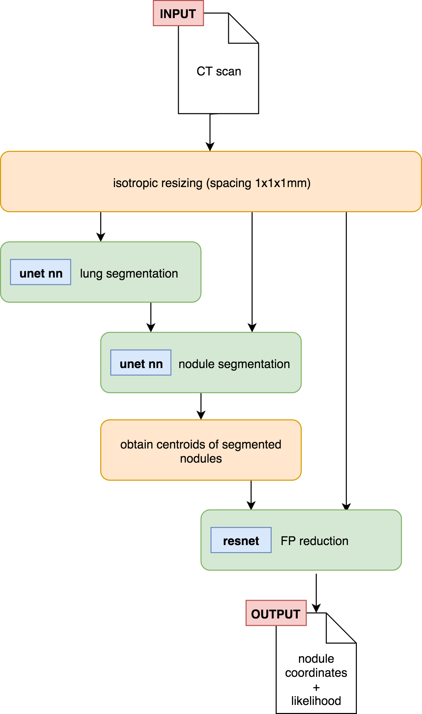

# Methods
\newpage

Even though there has been much effort in developing new techniques to improve the performance of CAD systems due to the availability of annotated datasets and challenges (NLST, ISBI, LUNA, DSB2017), the published systems tend to be brittle and very much focused on demonstrating good results on those specific challenges but useless as an integrated system. Also, what is not available tends to be proprietary systems, which might be good, but who knows really.

{ width=40% }

One of the improvements that I wanted to bring to the state of the art was to prepare a system which could be easily deployed in a real system. To achieve this I had to automate the scan preprocessing and prepare a full pipeline that could later on be integrated in a real system. In fact, this integration with a system has been performed by Albert <!--TODO put ref -->, that has a queue which picks up the scan and returns a CSV with the annotated nodules to check for.

What do we need to do:

- preprocessing: basically reading the ct scan in a SimpleITK compatible format and rescale it to 1x1x1mm
- lung segmentation: using the input from before, segment the lung and get a segmentation mask
- nodule segmentation: using the isotropic scan and the lung segmentation, compute the segmentation mask for the nodules, then measure the centroids of the labels and convert those coordinates to real world coordinates.
- fp reduction: Using the scan and the centroids in the previous step, apply the nodule classifier and retrieve a probability for each of the nodules. Once we have this probability per candidate, discard any that are below a required threshold. If instead of using a probability threshold what we are interested is in a false positive rate, use the numbers in the evaluation phase to basically determine how the probability maps to a specific FPR, and adjust the output candidates with that.

To run this basically I've packaed everything in a conda environment. This has allowed me to list all the necessary packages and provide an easy way to create environments with all the necessary dependencies, even stuff like CUDA libraries, which is not native python, can be easily installed using conda. This also makes it very easy to then create a Docker image that has all the necessary packages to run this stuff.

What else? Well, the docker image contains the weights of the different neural networks. I've basically just included the best network for each of the steps, based on the evaluation of the results. Both the code, dependencies and weights is included in a Docker image, which can also have GPU support (very much recommended) by using [nvidia-docker](https://github.com/NVIDIA/nvidia-docker).

Once that is built, we have a ready to go image, which only needs to mount 2 volumes (folders) for the input image and the output result. Then it's just a matter of running a command and all of this code can be easily run. Apart from the ease in reproducibility (not only the final script can be executed, but everything else, such as evaluation scripts and the like), we gain a very convenient way to distribute the results and an even better way to test our system in other datasets with minimum hassle, since the whole pipeline has been integrated.

Currently on an i7 7700, 32GB of RAM, GTX 1080Ti, evaluating a scan from start to finish requires around 2mins of processing time.

## Lung segmentation
To perform the automated lung segmentation of a CT scan we will use the same deep learning U-Net architecture as in the nodule segmentation. The U-Net will use a batch normalization and ReLU prior to any convolutional layer, as suggested in \[@Chen2018\]. The training will be performed over 40 epochs. Subsets 0 to 7 of the LUNA dataset will be used for training, subset 8 for validation and subset 9 for testing. The learning rate is set to *1e-3*, with Adam \[@Kingma2014\] as our optimization algorithm, which will adaptatively adjust the learning rate. The batch size is 5 and the weights randomly initialized. Hardware wise, we employed an Intel i7 7700, 32GB of RAM and a Nvidia 1080Ti GPU. The network was implemented with Keras \[@chollet2015keras\], using Tensorflow \[@Agarwal2015\]as its backend. The inverse of the Dice coefficient was used as loss function:

$$loss = 1 - DSC =  1 - \frac{2 |X \cap Y|}{|X|+ |Y|}$$

As part of our preprocessing, the scans will be isotropically resampled to a voxel size of 1x1x1mm. To train this network there is no image augmentation process nor any image filtering applied beforehand. The input passed to the network consists of an axial slice of a CT scan sized 400x400. The ground truth corresponds to the corresponding binary mask slice. They've also been automatically segmented using \[@VanRikxoort2009a\], which combines both a fast pass applying thresholding and then a second finer phase that corrects erroneous areas with applying state of the art methods. The masks are also provided as part of the challenge.

To evaluate the results of our resulting network, we will calculate the Dice coefficient of each slice and then average it accross the whole scan.

## Nodule detection
The basic setup for the nodule detection is the same segmentation network used on the lung segmentation. That is, a U-Net with batch normalization and ReLU, trained over 40 epochs. The dataset is split the same way: subsets 0 to 7 for training, subset 8 for validation and subset 9 for testing. We're also using a learning rate of *1e-3*, Adam, and the same hardware (Intel i7 7700, 32GB of RAM and a Nvidia 1080Ti GPU). This is where the similarities with the previous section end, as the preprocessing steps and the network variations are much different to train the same network to perform nodule segmentation.

The LUNA dataset only has annotations of the centroid and diameter of the annotated nodules, so we had to manually create segmentation masks. For this, we created spherical masks using the annotated diameter on the corresponding centroid. This masks are quite accurate on smaller nodules, but not so much when the diameter increases (>15mm). This spherical masks have a voxel size of 1x1x1 and a resolution of 400x400 in their axial plane.

As input, we used the axial slices of the CT scans, clipped with their matching lung mask. Values outside the mask were set to -4000HU, which is below the values for air. This artificially low number was a way to tell the network that areas outside the lung were not of our interest. Also, the same lung mask is used to clip the nodule masks, as nodules around the parenchyma could appear otherwise outside the lung, which would confuse the network since it has been clipped.

Only slices with visible nodules were used to train this network. Slices without abnormalities were discarded. This was done to correct the class imbalance that we were otherwise facing. At the slice level we used the Dice coefficient to compute its score, but evaluating a scan requires to:

1. Apply the segmentation network over the whole scan
2. Label the predicted mask using connected components \[@VanderWalt2014, @Fiorio1996, @Wu2005\]
3. Extract the centroid of said labels
4. Convert the coordinates of the centroid to the real world coordinates of the original scan
5. Check whether the euclidean distance between a candidate and any of the scan annotations is within its radius. If it is, count that candidate as a True Positive. Otherwise it will be a False Positive.

The evaluation of the system will report two metrics: sensitivity and average false positives per scan. Our main goal is to achieve the highest possible sensitivity, but reducing false positives will simplify the task of our false positive reduction module, so it is worth keeping track of its score.

There is also a set of variations in the preprocessing that we've applied incrementally so that we could study their invividual impact in the performance analysis. A different network has been trained from scratch for each of those variations, using both a binary cross entropy and Dice as loss functions. The variations are:

- **normalization:** Train the network with and without the use of batch normalization in its convolutional layers.
- **augmentation:** Enable the use of randomized image augmentation. Full description of the parameters in Table \ref{transformations_nodule_segmentation}.
- **3ch depth:** Use the 3 color channels of an image to pass the current slice along its two contiguous slices.
- **laplacian filter:** Apply a laplacian filter on the slice to increase its contrast.

|   transformation   |     range     |
| -----------------: | :------------ |
|           rotation | [-10º, +10º]  |
|           shearing | [-20%, +20%]  |
|            scaling | [-20%, +20%]  |
|    flip vertically | [True, False] |
|  flip horizontally | [True, False] |

: Range of transformations randomly applied to the axial slices used in the nodule segmentation training. \label{transformations_nodule_segmentation}

Apart from studying the impact in performance of each of the variations, we will also analyze the diversity of the resulting candidates, to ponder the usefulness of ensembling them into a more complete model.

## False positive reduction

### Handpicked feature classifier

#### Selected features
As seen in the previous chapter, the probability map obtained by the segmented slices is not informative enough to calculate the likelihood of the predictions, but the shape of the labels themselves potentially hold information that can help us distinguish between real and false nodules. To explain this concept visually, we can compare the segmented nodules A and C in Figure \ref{fp_reduction_segmented_nodules}. The first one is an example of a large nodule, mostly round, mostly contiguous in the Z-axis. Nodule C, on the contrary, while having a round segmentation in the axial plane, is almost flat, which typically translates to a false positive. Another frequent source of false positives are caused by the presence of airways in the lung. On a single slice they can be easily mistaken for a nodule, but if we pay attention to their coronal and sagittal projections we will appreciate large displacements, forming an elliptical shape. This effect can be observed to some degree in nodule B, and more agressively in nodule D.

{ width=50% }

Based on the visual inspection of the masks obtained by our segmentation, we engineered the following features to characterize the nodules:

diameter

:   mesures diameter (in mm) of the bounding box in the axial plane.

layers

:   measures number of contiguous layers of the bounding box in the z-axis.

squareness

:   measures how similar the shape is between the axial and its ortogonal planes. Values range between 0 and 1. 0 means ratio between axial and the ortogonal planes (sagittal and coronal) is the same. 1 would mean that one side is completely square, while the other flat. Formulated as:

$$squareness(length, width, depth) = abs\left(\frac{min\{width, length\}}{max\{width, length\}} - \frac{min\{depth, \frac{width + length}{2}\}}{max\{depth, \frac{width + length}{2}\}}\right)$$

extent

:   measures the ratio between masked and unmasked area in a labeled bounding box. Formulated as:

$$extent = \frac{num\ masked\ pixels\ of\ bbox}{num\ total\ pixels\ of\ bbox}$$

axial eccentricity

:   measures the geometric eccentricity of the segmented nodule projected on the axial plane. 0 would indicate the projection is a perfect circle.

sagittal eccentricity

:   measures the geometric eccentricity of the segmented nodule projected on the sagittal plane. 0 would indicate the projection is a perfect circle.

It should be noted that these features are only capturing basic information about the shape of the segmentations. This model ignores texture or other finer-grained features based on shape.

#### Training the model
We're going to train multiple binary classifiers with the features presented above and compare their performance quantitatively employing the AUROC. We're also going to plot the entire ROC curve to qualitativaly assess the behaviour of the classifier as the false positive rate increases. The tests will be performed both on the training and test sets, so we can also compare the performance of both side-by-side and assess the tendency to overfit of each of the classifiers.

The training and testing will be performed on the candidates obtained by the segmentation network based on binary cross entropy plus all variations (see previous chapter). Candidates from subsets 0 to 8 will be used as training data, while candidates in subset 9 will serve as our test dataset. We're not going to tune hyperparameters on the classifiers, so no validation set will be employed. This basically leaves us a dataset with a 4 to 1 ratio in FP vs TP that we will not rebalance. More details about the dataset can be found in Table \ref{dataset_candidates_baseline}.

|                          | **Training (subsets 0 to 8)** | **Test (subset 9)** |
| -----------------------: | :---------------------------- | :------------------ |
|      **number of scans** | 776                           | 84                  |
| **number of candidates** | 5415                          | 599                 |
|                   **TP** | 1032                          | 93                  |
|                   **FP** | 4383                          | 506                 |
|  **average FP per scan** | 5.6482                        | 6.0238              |

: Baseline from running the segmentation network. The classifier will be trained and evaluated on the features extracted form those candidates. \label{dataset_candidates_baseline}

<!-- data obtained from visualize_candidate_results.ipynb notebook-->

We've selected a list of 5 classification algorithms (see Table \ref{fp_reduction_classifier_types}), from simple logistic regression models to more advanced tree boosting classifiers, in an attempt to understand what sort of classification strategy works best both in terms of performance and generalization. We've used the `scikit-learn` \[@Nielsen2016\] implementation of those algorithms, initialized with default parameters, for training and evaluation purposes.

|     Classifiers     |
| ------------------- |
| Logistic regression |
| Decision tree       |
| Random forest       |
| AdaBoost            |
| Gradient boosting   |

: Types of classifiers trained on the candidates' dataset \label{fp_reduction_classifier_types}

### Radiomics based classifier

Expanding on the idea of the previous classifier, we wanted to further investigate the applicability of radiomics \[@Gillies2016\] to discriminate between nodules and false positives. In this classifier, instead of training it based on manually handpicked features, we've used the software package pyradiomics \[@VanGriethuysen2017\] to automatically extract 105 features from each nodule segmentation. Instead of comparing different classification algorithms, we've used the same AdaBoost with different subsets of radiomic features. We have tested its predictive performance with 105 features, 20 and 5 (the last two cases after applying a dimensionality reduction with PCA). This allows us to determine how much of a predictive advantage are we obtaining in comparison to the features we've manually engineered. A complete list of the extracted features can be reviewed in \[@VanGriethuysen2018\].

Methodology wise, the only difference in reference to the system trained on the handpicked features lies in the feature extracting process. We've transformed the scan segmentation masks to individual nodule masks, each of which is used in conjunction with the scan to automatically extract the features. The pyradiomics package also allows us to apply different filters on the original scan, and then extract them based on the filtered image, but we haven't used that functionality in this particular experiment.

### ResNet based classifier

We're going to train multiple volumetric ResNet networks with different depths and compare their performance quantitatively emplying the AUROC. Similarly to what we've done in the manual feature classifier, we'll also plot the entire ROC curve of the classifier. As before, both training and testing curves will be plotted side by side, to assess the overfitting of the model.

Regarding the network architecture itself, we introduced the suggestions by \[@Chen2018\] and added a batch normalization and ReLU layer before each convolutional layer on the residual module, to facilitate convergence and weight stability while training. The same network was trained on different layer depths: 34, 50, 101 and 152.

As training data we will use the annotations provided by LUNA for the false positive reduction track of the challenge. They contain the world coordinates of the candidate centroid and a label indicating whether or not it is a nodule. See Table \ref{fp_reduction_resnet_dataset_table} for details regarding the distribution of this dataset. We will evaluate the model against the candidates obtained by the same segmentation network as in the previous section, so that we can compare the performance between the two different methods.

|       dataset split       |   FP   |  TP  |  ratio   |
| ------------------------: | :----- | :--- | :------- |
| training (subsets 0 to 7) | 603345 | 1218 | 495 to 1 |
|     validation (subset 8) | 74293  | 195  | 381 to 1 |
|           test (subset 9) | 75780  | 144  | 526 to 1 |

: Number of entries per class in the candidate annotations dataset, divided by split. The class imbalance between the two categories is very prominent, which we'll have to take into account when training the network. \label{fp_reduction_resnet_dataset_table}

Since we are not using an ensemble of multiple models, the volumetric patch we will use as input should capture the entirety of the nodule. Based on the data observed in Figure \ref{freq_distribution_candidates}, the dataset does not contain diameters above 32mm, so we will fix the input resolution to be `32x32x32x1`. The scans have been rescaled to a spacing of 1x1x1mm and the images only have 1 color channel, with values corresponding to the Hounsfield value of the voxel (no normalization or clipping applied in the preprocessing).

The training is performed for a maximum of 50 epochs, only saving the weights in the iterations with better validation loss. We're using Adam as our method for stochastic optimization, initialized to a learning rate of *1e-3*. Early stopping is applied if the validation loss is not shown to improve in 10 consecutive epochs. The batch size for resnets {34, 50 and 101} was 64, while the batch size for resnet 152 was 32 due to memory constrains on the GPU side. Binary crossentropy was used as the loss function. The hardware employed during training consisted on an Intel i7 7700, 32GB of RAM and a Nvidia 1080Ti GPU.

To offset the data imbalance observed in the dataset (see Table \ref{fp_reduction_resnet_dataset_table}) we will oversample the nodule annotations with replacement so the training and validation ratio is 2 to 1 (FP vs TP). This effectively means that a nodule annotation will be seen during training 250 times per each non-nodule one, which could very well induce the network to overfit. We mitigate this effect by using 3D image augmentation. As detailed in Table \ref{fp_reduction_volume_augmentation}, affine transformations are randomly applied to the input cube before passing it to the neural network. Since this transformations would be lossy if applied to the actual cube of 32x32x32, we actually retrieve a larger cut of 46x46x46, apply the augmentation, and return a centered view of 32 pixels per side. The augmentation cube side needs to be larger than the diagonal of the input one for this to be valid. Also important, the augmentations are randomly applied to each sample each time and the dataset is shuffled on each epoch.

|   transformation   |     range     |
| -----------------: | :------------ |
|           rotation | [-90º, +90º]  |
|           shearing | [-20%, +20%]  |
|            scaling | [-10%, +10%]  |
|    flip vertically | [True, False] |
|  flip horizontally | [True, False] |
|  translation width | [-2px, +2px]  |
| translation height | [-2px, +2px]  |

: Range of transformations randomly applied to both the axial and coronal planes of the input volume \label{fp_reduction_volume_augmentation}

It should also be noted that the training and validation have been performed on a smaller fraction (35%) of the original data. This is the case purely due to hardware limitations when performing the experiment. Basically, extracting small patches of data from a much larger image is only fast if said image is already loaded, so we reduced the dataset size until it could fit in memory (32GB). Preloading the scans in-memory instead of reading them from disk supposed a speed-up larger than 2 orders of magnitude per epoch, so we considered the trade-off worthwhile.

## LUNA performance comparative
Once the individual systems have been evaluated, we pick the best variations of nodule detector and false positive reduction and rank it according to the LUNA grand challenge rules. For this, we will have to plot the FROC curve at the average false positives rates between 0.125 and 8. Also, we will report the average sensitivity at the selected false positive rates of {0.125, 0.25, 0.5, 1, 2, 4, 8}.

It should be noted that there is a set of excluded annotations available in the LUNA dataset that neither count as false positives nor true nodules. Any candidate matching one of those annotations need to be ignored towards the results. Another caveat of our particular comparison is the fact that the challengers in the LUNA scoreboard train their models performing a 10-fold cross validation over the whole dataset, and then evaluate their results on all the annotations, using a 1000 bootstraps. The reported metrics for our system will only be calculated over the test split (subset 9 of LUNA), on a model that has not been cross validated. This is mostly due to the required time and resources that we would need for this training to finish. We still feel it is a fair assessment, on the understanding that it is not biased to favour our system.

