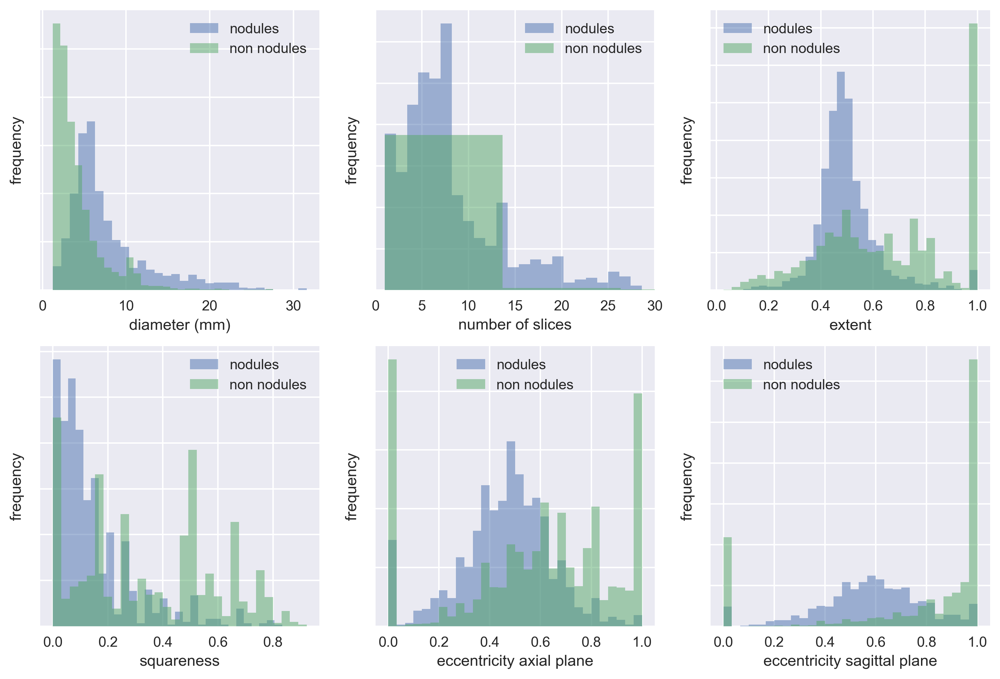

# Methods
\newpage

## Lung segmentation
Pretty much the same as the nodule segmentation, but actually with less preprocessing. I have to check whether or not I did stuff like laplacians and augmentations (I don't think so, really).

Mention that the lung segmentation performed in Luna is based on the method presented in @VanRikxoort2009a.

Also, in terms of how I am going to evaluate this, 2 measures. One is the typical DICE score, which OK, is good. Problem is, the segmentation itself, although is based on state of the art methods (and here I should really ask with Mario how they were performed, and add this to the introduction of this section). So, since this is basically a preprocessing step, and what I am interested in is to actually detect nodules, what I am going to do is compare how much nodule mass the segmentation is cutting out, compared to the nodule mass lost in the original masks. And if it is close enough, basically I'm going to consider this good enough.

## Nodule detection
Explain the basis of the unet network I am using. Explain also the batch normalization and relu layers I've introduced on the convolutional layers of the network. Also explain all the variations, both in terms of augmentation and preprocessing that I am applying.

Finally talk about the actual evaluation system, which in this case it ain't even visual. Mostly just sensitivity and average FP per scan, which is not nearly as important.

Also interesting and should be mentioned, we want to know if the variants are diverse. That is, if different variations of the network capture different nodules (to test if an ensamble would be a worthwhile approach).

## False Positive reduction

### Handpicked feature classifier

#### Selected features
As seen in the previous chapter, the probability map obtained by the segmented slices is not informative enough to calculate the likelihood of the predictions, but the shape of the labels themselves potentially hold information that can help us distinguish between real and false nodules. To explain this concept visually, we can compare the segmented nodules A and C in Figure \ref{fp_reduction_segmented_nodules}. The first one is an example of a large nodule, mostly round, mostly contiguous in the Z-axis. Nodule C, on the contrary, while having a round segmentation in the axial plane, is almost flat, which typically translates to a false positive. Another frequent source of false positives are caused by the presence of airways in the lung. On a single slice they can be easily mistaken for a nodule, but if we pay attention to their coronal and sagittal projections we will appreciate large displacements, forming an elliptical shape. This effect can be observed to some degree in nodule B, and more agressively in nodule D.

{ width=50% }

Based on the visual inspection of the masks obtained by our segmentation, we engineered the following features to characterize the nodules:

diameter

:   mesures diameter (in mm) of the bounding box in the axial plane.

layers

:   measures number of contiguous layers of the bounding box in the z-axis.

squareness

:   measures how similar the shape is between the axial and its ortogonal planes. Values range between 0 and 1. 0 means ratio between axial and the ortogonal planes (sagittal and coronal) is the same. 1 would mean that one side is completely square, while the other flat. Formulated as:

$squareness(length, width, depth) = abs\left(\frac{min\{width, length\}}{max\{width, length\}} - \frac{min\{depth, \frac{width + length}{2}\}}{max\{depth, \frac{width + length}{2}\}}\right)$

extent

:   measures the ratio between masked and unmasked area in a labeled bounding box. Formulated as:

$extent = \frac{num\ masked\ pixels\ of\ bbox}{num\ total\ pixels\ of\ bbox}$

axial eccentricity

:   measures the geometric eccentricity of the segmented nodule projected on the axial plane. 0 would indicate the projection is a perfect circle.

sagittal eccentricity

:   measures the geometric eccentricity of the segmented nodule projected on the sagittal plane. 0 would indicate the projection is a perfect circle.

It should be noted that these features are only capturing basic information about the shape of the segmentations. This model ignores texture or other finer-grained features based on shape.

#### Training the model
We're going to train multiple binary classifiers with the features presented above and compare their performance quantitatively employing the AUROC. We're also going to plot the entire ROC curve to qualitativaly assess the behaviour of the classifier as the false positive rate increases. The tests will be performed both on the training and test sets, so we can also compare the performance of both side-by-side and assess the tendency to overfit of each of the classifiers.

The training and testing will be performed on the candidates obtained by the segmentation network *augmentation_normalization_bce_3ch_laplacian_f6c98ba* from the previous chapter. Candidates from subsets 0 to 8 will be used as training data, while candidates in subset 9 will serve as our test dataset. We're not going to tune hyperparameters on the classifiers, so no validation set will be employed. This basically leaves us a dataset with a 4 to 1 ratio in FP vs TP that we will not rebalance. More details about the dataset can be found in Table \ref{dataset_candidates_baseline}.

|                          | **Training (subsets 0 to 8)** | **Test (subset 9)** |
| -----------------------: | :---------------------------- | :------------------ |
|      **number of scans** | 776                           | 84                  |
| **number of candidates** | 5415                          | 599                 |
|                   **TP** | 1032                          | 93                  |
|                   **FP** | 4383                          | 506                 |
|  **average FP per scan** | 5.6482                        | 6.0238              |

: Baseline from running the segmentation network *augmentation_normalization_bce_3ch_laplacian_f6c98ba*. The classifier will be trained and evaluated on the features extracted form those candidates. \label{dataset_candidates_baseline}

<!-- data obtained from visualize_candidate_results.ipynb notebook-->

We've selected a list of 5 classification algorithms (see Table \ref{fp_reduction_classifier_types}), from simple logistic regression models to more advanced tree boosting classifiers, in an attempt to understand what sort of classification strategy works best both in terms of performance and generalization. We've used the `scikit-learn` (@Nielsen2016) implementation of those algorithms, initialized with default parameters, for training and evaluation purposes.

|     Classifiers     |
| ------------------- |
| Logistic regression |
| Decision tree       |
| Random forest       |
| AdaBoost            |
| Gradient boosting   |

: Types of classifiers trained on the candidates' dataset \label{fp_reduction_classifier_types}

### Radiomics based classifier

All the actual features extracted:
- original_firstorder_10Percentile
- original_firstorder_90Percentile
- original_firstorder_Energy
- original_firstorder_Entropy
- original_firstorder_InterquartileRange
- original_firstorder_Kurtosis
- original_firstorder_Maximum
- original_firstorder_Mean
- original_firstorder_MeanAbsoluteDeviation
- original_firstorder_Median
- original_firstorder_Minimum
- original_firstorder_Range
- original_firstorder_RobustMeanAbsoluteDeviation
- original_firstorder_RootMeanSquared
- original_firstorder_Skewness
- original_firstorder_TotalEnergy
- original_firstorder_Uniformity
- original_firstorder_Variance
- original_glcm_Autocorrelation
- original_glcm_ClusterProminence
- original_glcm_ClusterShade
- original_glcm_ClusterTendency
- original_glcm_Contrast
- original_glcm_Correlation
- original_glcm_DifferenceAverage
- original_glcm_DifferenceEntropy
- original_glcm_DifferenceVariance
- original_glcm_Id
- original_glcm_Idm
- original_glcm_Idmn
- original_glcm_Idn
- original_glcm_Imc1
- original_glcm_Imc2
- original_glcm_InverseVariance
- original_glcm_JointAverage
- original_glcm_JointEnergy
- original_glcm_JointEntropy
- original_glcm_MaximumProbability
- original_glcm_SumAverage
- original_glcm_SumEntropy
- original_glcm_SumSquares
- original_gldm_DependenceEntropy
- original_gldm_DependenceNonUniformity
- original_gldm_DependenceNonUniformityNormalized
- original_gldm_DependenceVariance
- original_gldm_GrayLevelNonUniformity
- original_gldm_GrayLevelVariance
- original_gldm_HighGrayLevelEmphasis
- original_gldm_LargeDependenceEmphasis
- original_gldm_LargeDependenceHighGrayLevelEmphasis
- original_gldm_LargeDependenceLowGrayLevelEmphasis
- original_gldm_LowGrayLevelEmphasis
- original_gldm_SmallDependenceEmphasis
- original_gldm_SmallDependenceHighGrayLevelEmphasis
- original_gldm_SmallDependenceLowGrayLevelEmphasis
- original_glrlm_GrayLevelNonUniformity
- original_glrlm_GrayLevelNonUniformityNormalized
- original_glrlm_GrayLevelVariance
- original_glrlm_HighGrayLevelRunEmphasis
- original_glrlm_LongRunEmphasis
- original_glrlm_LongRunHighGrayLevelEmphasis
- original_glrlm_LongRunLowGrayLevelEmphasis
- original_glrlm_LowGrayLevelRunEmphasis
- original_glrlm_RunEntropy
- original_glrlm_RunLengthNonUniformity
- original_glrlm_RunLengthNonUniformityNormalized
- original_glrlm_RunPercentage
- original_glrlm_RunVariance
- original_glrlm_ShortRunEmphasis
- original_glrlm_ShortRunHighGrayLevelEmphasis
- original_glrlm_ShortRunLowGrayLevelEmphasis
- original_glszm_GrayLevelNonUniformity
- original_glszm_GrayLevelNonUniformityNormalized
- original_glszm_GrayLevelVariance
- original_glszm_HighGrayLevelZoneEmphasis
- original_glszm_LargeAreaEmphasis
- original_glszm_LargeAreaHighGrayLevelEmphasis
- original_glszm_LargeAreaLowGrayLevelEmphasis
- original_glszm_LowGrayLevelZoneEmphasis
- original_glszm_SizeZoneNonUniformity
- original_glszm_SizeZoneNonUniformityNormalized
- original_glszm_SmallAreaEmphasis
- original_glszm_SmallAreaHighGrayLevelEmphasis
- original_glszm_SmallAreaLowGrayLevelEmphasis
- original_glszm_ZoneEntropy
- original_glszm_ZonePercentage
- original_glszm_ZoneVariance
- original_ngtdm_Busyness
- original_ngtdm_Coarseness
- original_ngtdm_Complexity
- original_ngtdm_Contrast
- original_ngtdm_Strength
- original_shape_Elongation
- original_shape_Flatness
- original_shape_LeastAxis
- original_shape_MajorAxis
- original_shape_Maximum2DDiameterColumn
- original_shape_Maximum2DDiameterRow
- original_shape_Maximum2DDiameterSlice
- original_shape_Maximum3DDiameter
- original_shape_MinorAxis
- original_shape_Sphericity
- original_shape_SurfaceArea
- original_shape_SurfaceVolumeRatio
- original_shape_Volume

### ResNet based classifier

We're going to train multiple volumetric ResNet networks with different depths and compare their performance quantitatively emplying the AUROC. Similarly to what we've done in the manual feature classifier, we'll also plot the entire ROC curve of the classifier. As before, both training and testing curves will be plotted side by side, to assess the overfitting of the model.

Regarding the network architecture itself, we introduced the suggestions by @Chen2018 and added a batch normalization and ReLU layer before each convolutional layer on the residual module, to facilitate convergence and weight stability while training. The same network was trained on different layer depths: 34, 50, 101 and 152.

As training data we will use the annotations provided by LUNA for the false positive reduction track of the challenge. They contain the world coordinates of the candidate centroid and a label indicating whether or not it is a nodule. See Table \ref{fp_reduction_resnet_dataset_table} for details regarding the distribution of this dataset. We will evaluate the model against the candidates obtained by the segmentation network *augmentation_normalization_bce_3ch_laplacian_f6c98ba*, just as in the previous section, so that we can compare the performance between the two different methods.

|       dataset split       |   FP   |  TP  |  ratio   |
| ------------------------: | :----- | :--- | :------- |
| training (subsets 0 to 7) | 603345 | 1218 | 495 to 1 |
|     validation (subset 8) | 74293  | 195  | 381 to 1 |
|           test (subset 9) | 75780  | 144  | 526 to 1 |

: Number of entries per class in the candidate annotations dataset, divided by split. The class imbalance between the two categories is very prominent, which we'll have to take into account when training the network. \label{fp_reduction_resnet_dataset_table}

Since we are not using an ensemble of multiple models, the volumetric patch we will use as input should capture the entirety of the nodule. Based on the data observed in Figure \ref{freq_distribution_candidates}, the dataset does not contain diameters above 32mm, so we will fix the input resolution to be `32x32x32x1`. The scans have been rescaled to a spacing of 1x1x1mm and the images only have 1 color channel, with values corresponding to the Hounsfield value of the voxel (no normalization or clipping applied in the preprocessing).

The training is performed for a maximum of 50 epochs, only saving the weights in the iterations with better validation loss. We're using Adam (@Kingma2014) as our method for stochastic optimization, initialized to a learning rate of `1e-3`. Early stopping is applied if the validation loss is not shown to improve in 10 consecutive epochs. The batch size for resnets {34, 50 and 101} was 64, while the batch size for resnet 152 was 32 due to memory constrains on the GPU side. Binary crossentropy was used as the loss function. The hardware employed during training consisted on an Intel i7 7700, 32GB of RAM and a Nvidia 1080Ti GPU.

To offset the data imbalance observed in the dataset (see Table \ref{fp_reduction_resnet_dataset_table}) we will oversample the nodule annotations with replacement so the training and validation ratio is 2 to 1 (FP vs TP). This effectively means that a nodule annotation will be seen during training 250 times per each non-nodule one, which could very well induce the network to overfit. We mitigate this effect by using 3D image augmentation. As detailed in Table \ref{fp_reduction_volume_augmentation}, affine transformations are randomly applied to the input cube before passing it to the neural network. Since this transformations would be lossy if applied to the actual cube of 32x32x32, we actually retrieve a larger cut of 46x46x46, apply the augmentation, and return a centered view of 32 pixels per side. The augmentation cube side needs to be larger than the diagonal of the input one for this to be valid. Also important, the augmentations are randomly applied to each sample each time and the dataset is shuffled on each epoch.

|   transformation   |     range     |
| -----------------: | :------------ |
|           rotation | [-90º, +90º]  |
|           shearing | [-20%, +20%]  |
|            scaling | [-10%, +10%]  |
|    flip vertically | [True, False] |
|  flip horizontally | [True, False] |
|  translation width | [-2px, +2px]  |
| translation height | [-2px, +2px]  |

: Range of transformations randomly applied to both the axial and coronal planes of the input volume \label{fp_reduction_volume_augmentation}

It should also be noted that the training and validation have been performed on a smaller fraction (35%) of the original data. This is the case purely due to hardware limitations when performing the experiment. Basically, extracting small patches of data from a much larger image is only fast if said image is already loaded, so we reduced the dataset size until it could fit in memory (32GB). Preloading the scans in-memory instead of reading them from disk supposed a speed-up larger than 2 orders of magnitude per epoch, so we considered the trade-off worthwhile.

## Overall Discussion
Maybe explain a bit of the tradeoffs? Essentially the feature based is much easier to explain (the features are still based on the magic performed by the UNET, which is not a good thing in terms of reasoning about the algorithm, but basically it stops there, whereas the NN is another black box on top of an already black box). Still, performance improvements compound in a system with long pipelines, so it can't be dismissed.

Also interesting is seeing how we hit a wall in terms of performance after a certain amount of layers. It seems like the network saturates at some point. Basically this could be due to A) image size and, surely also helps, the fact that we are working with a reduced dataset, which won't help us to train properly the model (although at least that makes it cheaper and faster, which is also nice and can't be dismissed).
