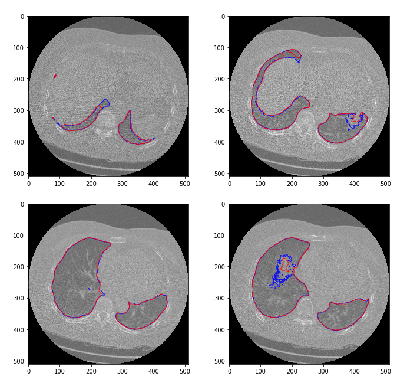
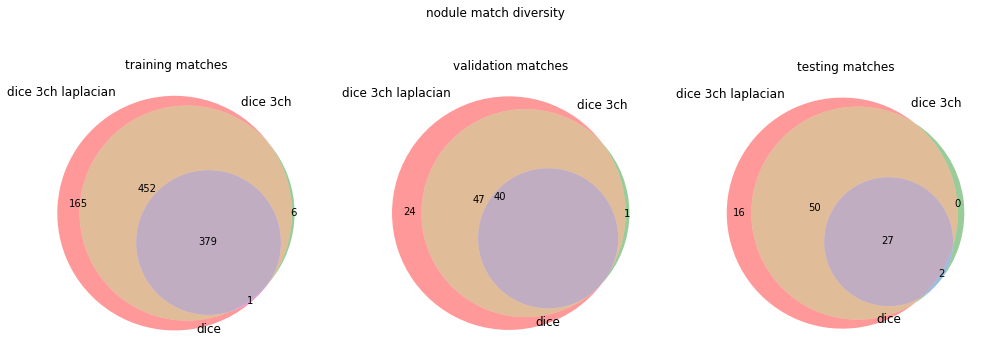
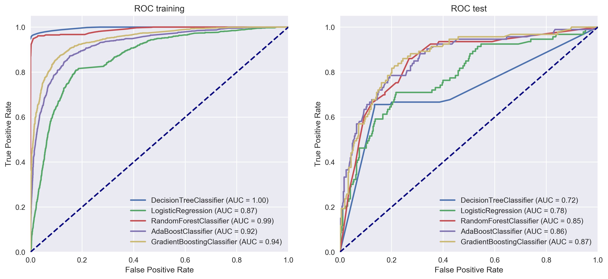
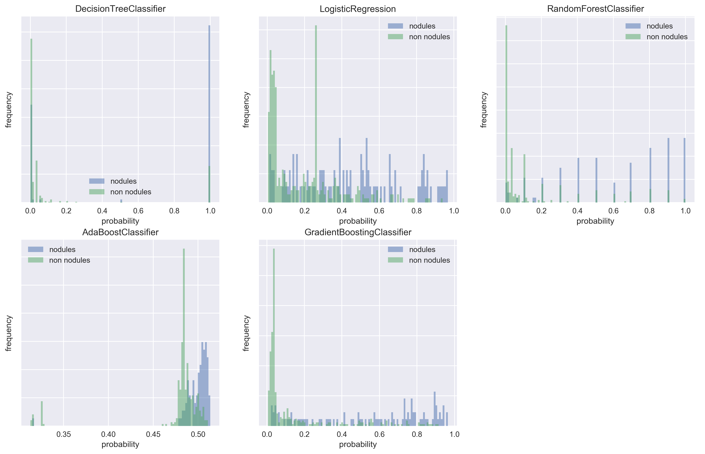
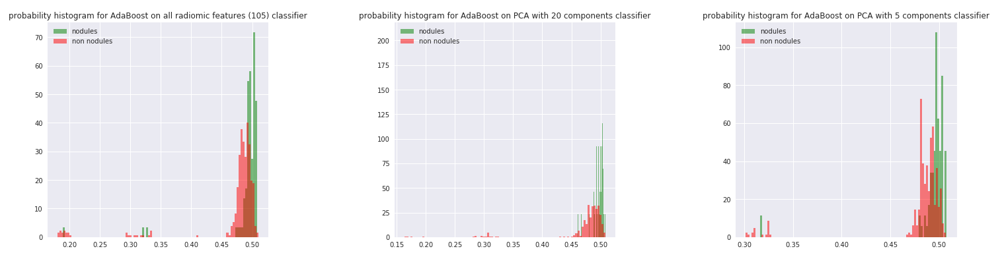
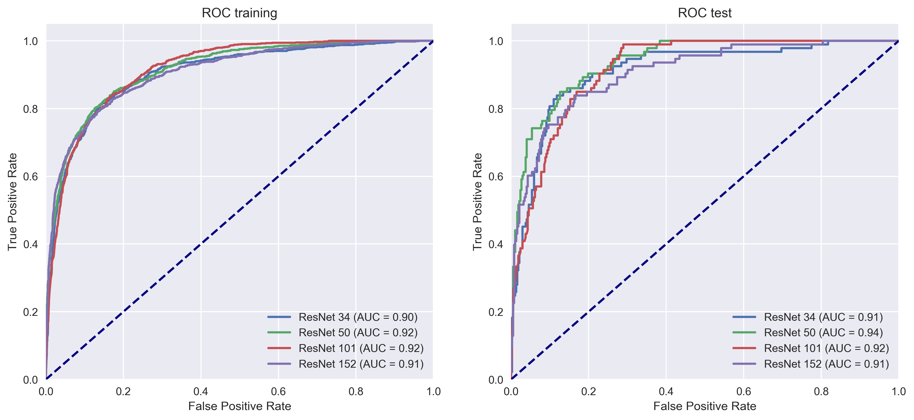
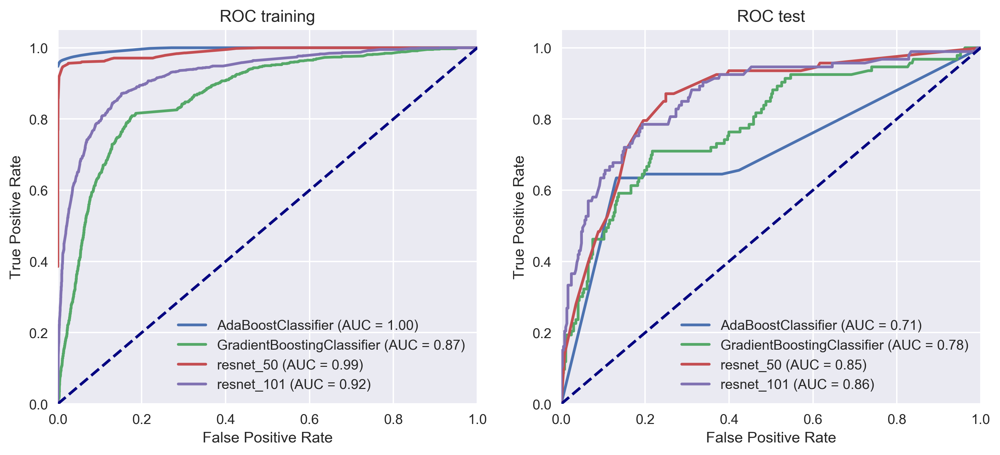
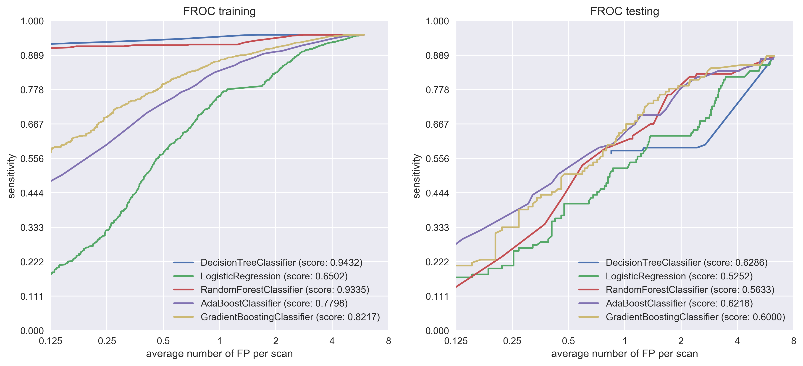
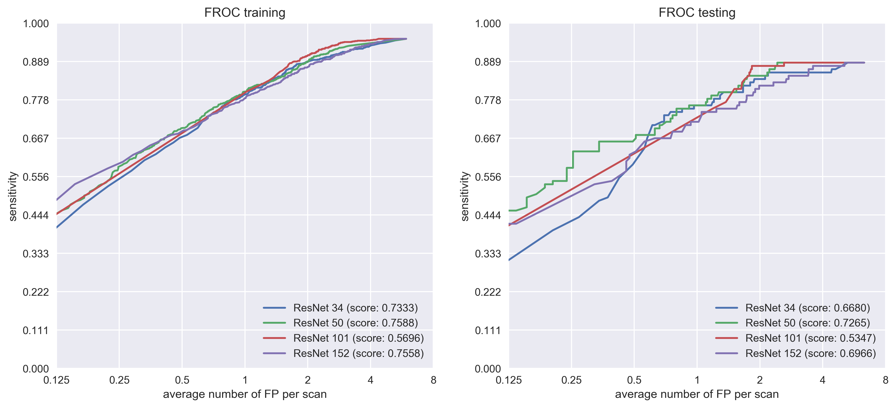
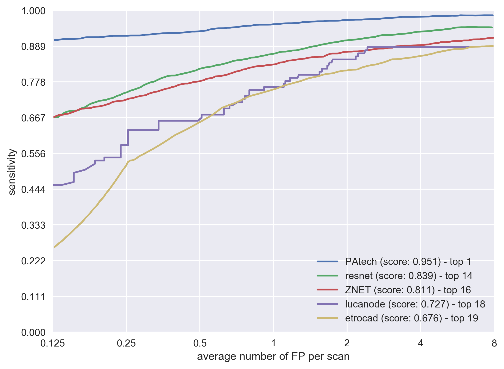

# Results
\newpage

The results chapter is divided in five sections. The first three report the metrics for each individual problem of the CAD pipeline, paying especial emphasis to the differential in performance between different approaches. The 4th section compares the metrics of the system against other competitors of the LUNA grand challenge to contextualize it within the state of the art. Finally, there is a 5th section that assesses qualitatively the efforts placed to integrate the system into a clinical context.

## Lung segmentation

The results of using the U-Net for lung segmentation purposes show a network that achieves a Dice score over 98% in 40 epochs of training, although it only takes two epochs for the scores to be above 96%. As we can see in Table \ref{lung_segmentation_mean_dice}, there are no signs of overfitting. In fact, the Dice coeficients for both the validation and testing sets are 0.5% better than the results on the training dataset, although this could be explained due to the extra variability found in the larger training dataset (616 CT scans vs 88 each on the validation and test splits).

| **dataset split** | **Dice score** |
| ----------------: | :------------- |
|        *training* | 0.977392       |
|      *validation* | 0.983458       |
|            *test* | 0.984037       |

: mean Dice coefficient for each dataset split. Each axial slice in the dataset is evaluated individually and then the mean is calculated in two steps. First the mean over the whole scan and then the mean over the dataset \label{lung_segmentation_mean_dice}.

The U-Net lung segmentation is especially accurate in the superior and middle lobe of the lung, as we can appreciate in the bottom left slice on Figure \ref{lung_segmentation}. Irregular areas with lower contrast, like the one in the left lung shown in the bottom right slice (same figure) can confuse the network. The trend is towards more expansive masks, which in our case is a valid trade-off, since this is only a preprocessing step done towards reducing the complexity of the nodule segmentation task, and we don't want to discard potential lung mass which may contain a nodule.

Lower lung lobes are generally those with lower Dice scores (see top left and right slices in Figure \ref{lung_segmentation}). It is also possible to observe holes inside a segmented lung (bottom right), which could be fixed by applying a morphological closing in the mask.

{ width=75% }

## Nodule detection

Our main metric for the nodule detection module is its sensitivity. This will determine the upper limit performance of the system. We will also keep track of the number of false positives returned, since this directly affects the complexity of the false positive reduction module. More false positives will require a more complex model in order to be competitive with the state of the art.

In Table \ref{nodule_detection_results} we have both metrics divided by the loss function used during the training phase and the different image processing variations applied. We haven't included the figures of the network trained without batch normalization as they were not very telling themselves, but we still wanted to report those negative results, because they were the key that allowed the network to learn. As we can see in Figure \ref{unet_normalization_vs_no_normalization}, a U-Net without normalization, neither on the input image nor on its convolutional layers, is incapable of learning the true representation of a nodule. Basically the only information it can extract form the original image is a rough segmentation of the lung parenchyma, which happens to be the area of major contrast in the original slice (as a reminder, a lung mask is applied as a preprocessing step, fixing the value of any voxel outside the lung tissue to -4000HU). This was the key discovery that made this approach feasible.

Both loss functions achieve similar top sensitivity scores in Table \ref{nodule_detection_results}. In general, binary cross entropy displays a more stable behaviour during training and it penalizes false positives more heavily, as we can see from looking at the false positive rates of both networks (3 to 1 ratio favoring binary cross entropy). The downside of this heavy penalization of false positives is a slight drop in sensitivity (*0.915* vs *0.930*) that caps the maximum performance of the system.

It is also worth mentioning the effect of applying augmentation to mitigate overfitting. If we take a look at the differences between the augmented binary cross entropy variation vs the non-augmented (Table \ref{nodule_detection_results}) the differential in training sensitivity barely achieves a 0.5%, but the gap between the training and testing scores goes from a 19% to 11%, and down to 6% in its best performing variation.

{ width=75% }

\begin{table}
\caption{U-Net nodule segmentation variations along with their sensitivity and number of FP per slice. It should be noted that nodule candidates may refer to the same annotation, so it is possible for the sensitivity to take values over 1. \label{nodule_detection_results}}
\begin{tabular}{rrrll}
\toprule
                        &       &      & sensitivity &         FP \\
                        &       &      &        mean &       mean \\
loss function & variation & set &             &            \\
\midrule
crossentropy & no augmentation, normalization & test &    0.783051 &   7.329545 \\
                               && train &    0.977351 &   6.707865 \\
                               && validation &    0.796944 &   6.840909 \\
\midrule
crossentropy & augmentation, normalization& test &    0.859275 &   6.011364 \\
                               && train &    0.972629 &   5.703652 \\
                               && validation &    0.922778 &   5.488636 \\
\midrule
crossentropy & augmentation, normalization, & \textbf{test} &    \textbf{0.915490} &   \textbf{5.750000} \\
        & 3ch, laplacian& train &    0.974303 &   5.515449 \\
                               && validation &    0.940417 &   5.181818 \\
\midrule
dice & no augmentation, normalization & test &    0.740254 &   7.125000 \\
                               && train &    0.828008 &   7.063202 \\
                               && validation &    0.795972 &   6.784091 \\
\midrule
dice & augmentation, normalization & test &    0.339407 &   1.443182 \\
                               && train &    0.390669 &   2.252809 \\
                               && validation &    0.399306 &   1.750000 \\
\midrule
dice & augmentation, normalization,& test &    0.803672 &  34.125000 \\
                          & 3ch & train &    0.818526 &  34.228933 \\
                               && validation &    0.806389 &  33.715909 \\
\midrule
dice & augmentation, normalization, & \textbf{test} &    \textbf{0.930791} &  \textbf{15.420455} \\
               & 3ch, laplacian & train &    0.944604 &  17.234551 \\
                               && validation &    1.044861 &  14.193182 \\
\bottomrule
\end{tabular}
\end{table}

We also analyzed whether the different variations introduced diversity in the nodules detected by the network. As we can see in Figure \ref{nodule_segmentation_diversity_dice}, the nature of each variation is purely additive. The network is able to detect more nodules while still discerning the previous subset. In practice, this would mean that we might need to develop an entirely different model to detect the nodules we are currently missing, so that an ensemble based on both models would beat their individual performance.

Finally, we compared the individual performance of our best segmentation networks against the results presented in the LUNA16 challenge survey (@Arindra2017) in Table \ref{nodule_detection_luna_perf_table}. Our network is able to beat the individual systems described in the paper both in sensitivity and in number of false positives reported by scan. It is especially in this last metric where the differences are the most striking. The U-Net trained with binary cross entropy is able to match the sensitivity of ETROCAD (best reported) within a 1%, but it is able to do so with 47 times lesser amount of candidates. The levels of accuracy provided by our network will, in fact, enable us to develop false positive reduction methods based on the nodule segmentation themselves, and still be competitive in the general LUNA scoreboard.

|      system     | sensitivity | avg num candidates / scan |
| --------------: | :---------- | :------------------------ |
|          ISICAD | 0.856       | 335.9                     |
|     SubsolidCAD | 0.361       | 290.6                     |
|        LargeCAD | 0.318       | 47.6                      |
|             M5L | 0.768       | 22.2                      |
|         ETROCAD | 0.929       | 333.0                     |
|  *lucanode bce* | 0.915       | 7.0                       |
| *lucanode dice* | 0.930       | 18.0                      |

: Candidate detection systems performance as reported by @Arindra2017. Even though each individual system is offering worse performance than our custom U-Net, an ensemble combining them reported sensitivity rates up to 0.983. \label{nodule_detection_luna_perf_table}

## FP Reduction

Explain how the classifiers compare. Basically explain the overfitting effect of the tree classifiers and how the boosting algorithms seem to be best and overfit less

Based on the probability distribution of the histogram we can demonstrate that both boosting algorithms are the ones that are better at separating between both groups. Basically it can be seen on the graphs that they follow two different distributions, with the least overlap between them.

In here the distinction is not as straightforward. There is basically a sweet spot at 50. 101 and 152 seem too deep for the amount of data we were training it with (just 35% of the half a milion annotations we had to start with), and really are not helping much. Basically it plateaus.

Again, put here the probability histograms. In this case, the differences are more subtle, as they should be, since the curves are much closer between them. It should be noted though that the overfitting effect is much lower than what we've observed with the previous method. Again, this is to be expected since we have a much larger dataset to train the classifier with. In fact, paradoxically, the better our segmentation is, the less data we have to train the dataset, which might make our FP reduction worse. Which is why it could be interesting to decouple both parts. At the same time, if we use features engineered from the segmentations, they are coupled through and through, so that approach will always have those limitations.

Basically, comparison side by side of both methods. resnet is better, as it should be, since it is a much more complex model, with N features (look up how many, actually), compared to the 6? of the other. Also important, it overfits less, again probably due to availability of data. The differences don't seem that major, but basically they compound with whatever performance the segmentation has, so a few percent points drop on the AUC are important. Also, the slope looks better, as it will be able to achieve better performance at lower FPR, which is very important for a system such as this. We need a slope as flat as possible, so that the results are very good even with very low rates of false positives.

## LUNA performance comparative

I can actually draw the curves manually of different competing systems by retrieving the numbers from the table in the LUNA paper, which really, would be the best approach to show my perf VS other systems.

## Integration into a clinical workflow
Hello
