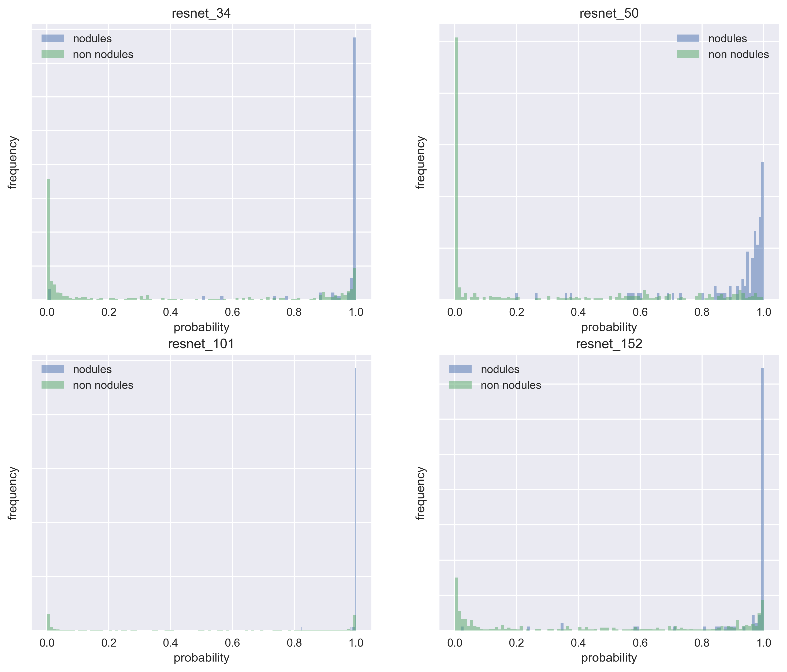
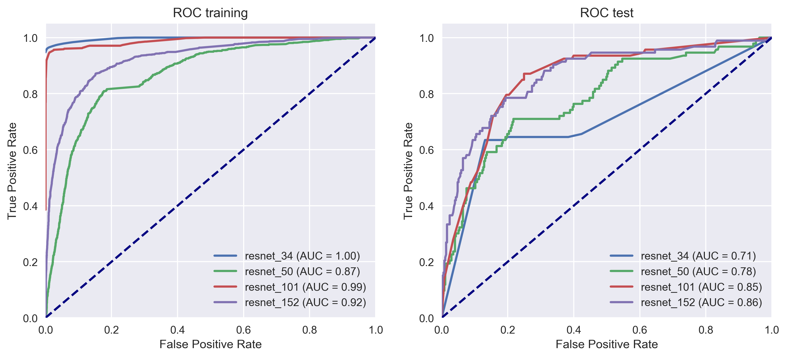

# False Positive reduction
\clearpage

## Introduction
Similarly to an object detection problem (@Hosang2016), we've divided our pipeline in two phases: candidate proposal and false positive reduction. As we have seen in the previous chapter, our UNET-based proposal network primed sensitivity above all else, but now we need a classifier with high precision so that the signal-to-noise ratio of the system will be high enough to prove useful to a radiologist.

One of the main benefits of performing a previous step to detect candidates is the fact that the search space is reduced and that makes it computationally feasible to run image recognition algorithms with high computational costs within a reasonable timeframe.

In this chapter we'll cover two different approaches to false positive reduction. The first one will be a classifier trained on features manually extracted from the previous segmentation phase of the pipeline. The second one is based on a volumetric ResNet (@Chen2018). The original 2D version of this deep neural network (@Wu2017) achieved a deeper architecture bypassing the vanishing/exploding gradients problem (@Bengio1994, @Glorot) by using a combination of normalization techniques (@Ioffe2015, @LeCun2012, @He2014) and the use of residuals (**add some ref based on @Wu2017 that would properly explain the concept**).

## Handpicked feature classifier

### Selected features
As seen in the previous chapter, the probability map obtained by the segmented slices is not informative enough to calculate the likelihood of the predictions, but the shape of the labels themselves potentially hold information that can come in handy. The intuition here is that we've trained what essentially is a 2D network on a volumetric problem, and after visual inspection of the obtained segmentations, once of the most frequent cases of erroneous segmentation is when the network confuses airways with nodules

**put a graph of an axial projection of a nodule mask + actual axial layers AND axial projection of FP air vessel + actual axial layers, so the displacement can be properly viewed**

Based on exploting this idea, what I am looking for are spherical and symmetric labels. Basically I want to be as close as possible to the original masks. I come up with the following features:

diameter

:   mesures diameter (in mm) of the bounding box in the axial plane.

layers

:   measures number of contiguous layers of the bounding box in the z-axis.

squareness

:   measures how similar the shape is between the axial and its ortogonal planes. Values range between 0 and 1. 0 means ratio between axial and the ortogonal planes (sagittal and coronal) is the same. 1 would mean that one side is completely square, while the other flat. Formulated as:

$squareness(length, width, depth) = abs\left(\frac{min\{width, length\}}{max\{width, length\}} - \frac{min\{depth, \frac{width + length}{2}\}}{max\{depth, \frac{width + length}{2}\}}\right)$

extent

:   measures the ratio between masked and unmasked area in a labeled bounding box. Formulated as:

$extent = \frac{num\ masked\ pixels\ of\ bbox}{num\ total\ pixels\ of\ bbox}$

axial eccentricity

:   measures the geometric eccentricity of the segmented nodule projected on the axial plane. 0 would indicate the projection is a perfect circle.

sagittal eccentricity

:   measures the geometric eccentricity of the segmented nodule projected on the sagittal plane. 0 would indicate the projection is a perfect circle.

It should be noted that these features are only capturing basic information about the shape of the segmentations. This model ignores texture or other finer-grained features based on shape.

### Methods
We're going to train multiple binary classifiers with the features presented above and compare their performance quantitatively employing the AUROC. We're also going to plot the entire ROC curve to qualitativaly assess the behaviour of the classifier as the false positive rate increases. The tests will be performed both on the training and test sets, so we can also compare the performance of both side-by-side and assess the tendency to overfit of each of the classifiers.

The training and testing will be performed on the candidates obtained by the segmentation network *augmentation_normalization_bce_3ch_laplacian_f6c98ba* from the previous chapter. Candidates from subsets 0 to 8 will be used as training data, while candidates in subset 9 will serve as our test dataset. We're not going to tune hyperparameters on the classifiers, so no validation set will be employed. This basically leaves us a dataset with a 4 to 1 ratio in FP vs TP that we will not rebalance. More details about the dataset can be found in Table \ref{dataset_candidates_baseline}.

|                          | **Training (subsets 0 to 8)** | **Test (subset 9)** |
| -----------------------: | :---------------------------- | :------------------ |
|      **number of scans** | 776                           | 84                  |
| **number of candidates** | 5415                          | 599                 |
|                   **TP** | 1032                          | 93                  |
|                   **FP** | 4383                          | 506                 |
|  **average FP per scan** | 5.6482                        | 6.0238              |

: Baseline from running the segmentation network *augmentation_normalization_bce_3ch_laplacian_f6c98ba*. The classifier will be trained and evaluated on the features extracted form those candidates. \label{dataset_candidates_baseline}

<!-- data obtained from visualize_candidate_results.ipynb notebook-->

We've selected a list of 5 classification algorithms (see Table \ref{fp_reduction_classifier_types}), from simple logistic regression models to more advanced tree boosting classifiers, in an attempt to understand what sort of classification strategy works best both in terms of performance and generalization. We've used the `scikit-learn` (@Nielsen2016) implementation of those algorithms, initialized with default parameters, for training and evaluation purposes.

|     Classifiers     |
| ------------------- |
| Logistic regression |
| Decision tree       |
| Random forest       |
| AdaBoost            |
| Gradient boosting   |

: Types of classifiers trained on the candidates' dataset \label{fp_reduction_classifier_types}

## ResNet based classifier
### Introduction
Why resnet? Set a bit of introduction as why are they good and how they've impacted the image recognition competitions.

### Methods
We're going to train multiple volumetric ResNet networks with different depths and compare their performance quantitatively emplying the AUROC. Similarly to what we've done in the manual feature classifier, we'll also plot the entire ROC curve of the classifier. As before, both training and testing curves will be plotted side by side, to assess the overfitting of the model.

As training data we will use the annotations provided by LUNA for the false positive reduction track of the challenge. See Table \ref{something} for details regarding the distribution of this dataset. We will evaluate the model against the candidates obtained by the segmentation network *augmentation_normalization_bce_3ch_laplacian_f6c98ba*, just as in the previous section, so we'll be able to compare the performance within variations of the same method and between different methods.

| annotations dataset |
| ------------------- |
| something           |
| something           |
| something           |

: \label{something}

Since we will not use an ensemble of multiple networks, we
ReLU for nonlinearity
batch normalization before

Resnet image input 32x32x32x1

The annotations contain the world coordinates of the candidate centroid and a label indicating whether or not it is a nodule.

Basically here say that in terms of evaluation, same method as before is employed. Preparation of the dataset though is quite different.

candidates_v2.csv is used, which is a list of coordinates with an annotation, whether or not it is a nodule. VERY imbalanced. Then talk about the subsets that I've employed and how I'm using just a window of 32x32x32 to capture the area centered around that point.

Talk about the augmentation procedure in 3D in detail. Explain what I use and what not. Talk about the trigonometry involved so I can actually use the full extent of affine transformations. Also discuss the problems due to memory constraints, and how I opted to use a smaller fraction of the dataset instead of hitting disk (much too slow). Put the back of the envelope numbers on how much memory would be needed to do things properly.

Once the model is trained, say that I evaluate the candidates obtained in the segmentation and output a probability. With that I calculate the ROC and its AUC, and that I can compare directly with the results I've obtained from the previous classifier, which is nice. Using the 1x1x1mm isotropic resize of the scan.

## Results

It would be nice to have the filters activation patterns for a nodule and a non-nodule. Explain this better plz.
I'm using 

## Overall Discussion
Put here some comparison between 
