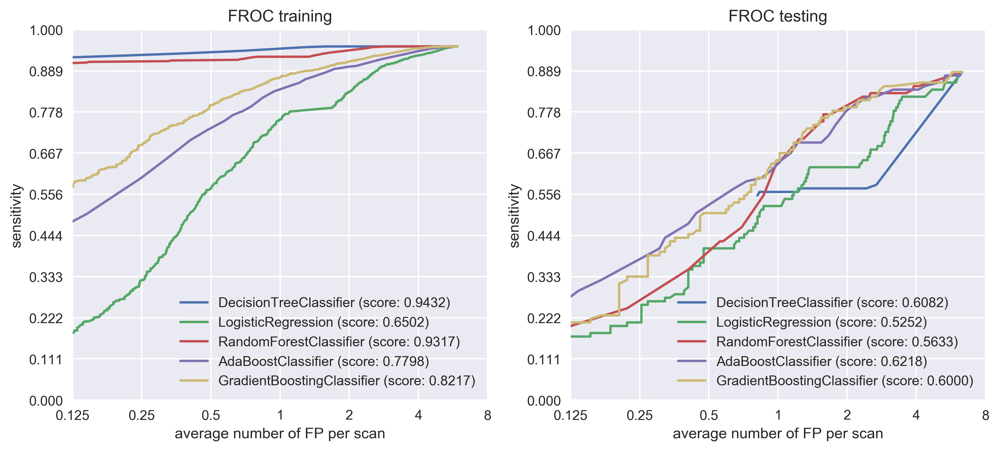
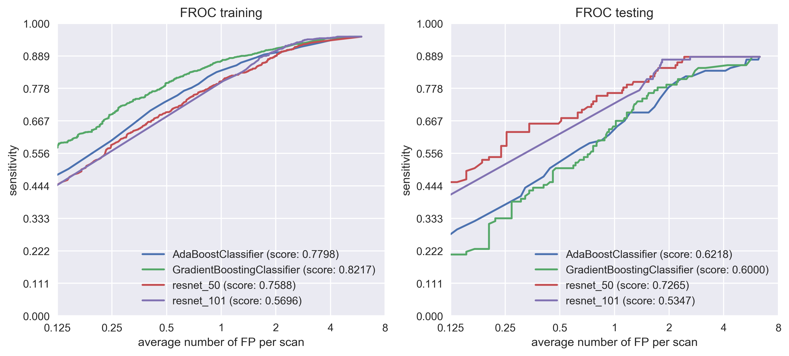

# Evaluating lucanode on LUNA

I can actually draw the curves manually of different competing systems by retrieving the numbers from the table in the LUNA paper, which really, would be the best approach to show my perf VS other systems.