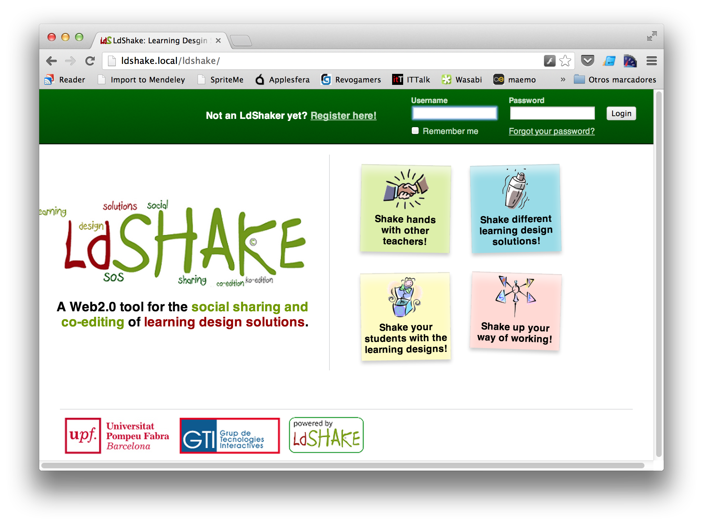
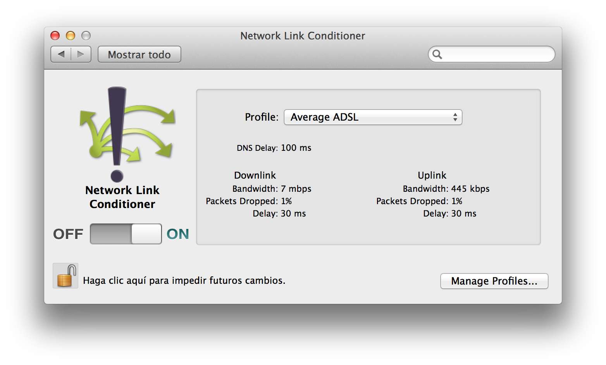
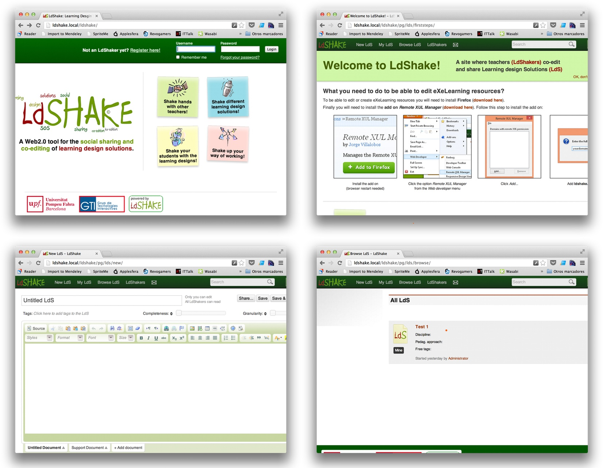
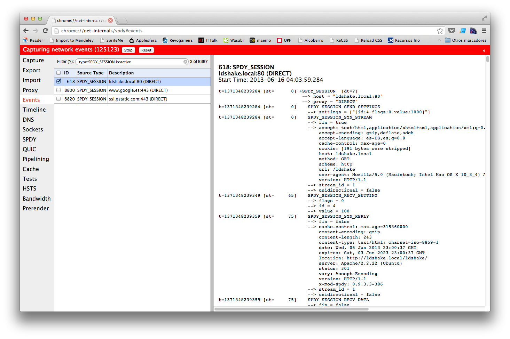
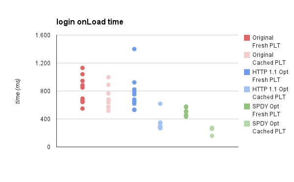
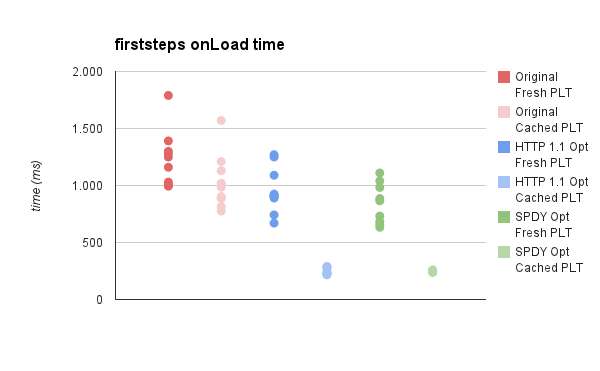
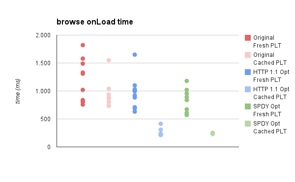
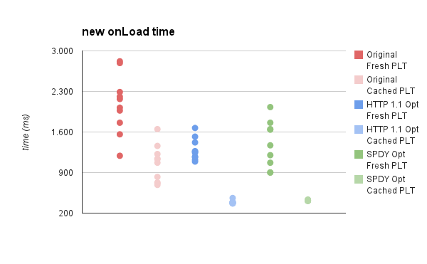

# Placeholder
Basically, examples on how to put Tables, figures, links and citations.

To put an end to this project we will do a performance assessment on LdShake ([http://ldshake.upf.edu](http://ldshake.upf.edu)) (@Hernandez-Leo2011). LdShake is a web application to share and edit learning design solutions mainly tailored at teachers. LdShake is built on top of the PHP Elgg framework ([http://elgg.org/](http://elgg.org/)), which makes development of social networks easier. It uses a fair amount of javascript, which is mainly used to add interactivity to the webpage, and elements like text editors. Once loaded, though, the pages don't make use of AJAX to modify the content dynamically. The platform is also quite sparse in image resources, so each page weights much less than the typical 1.5MB we saw in the introductory chapter.

Overall, we could say that LdShake is lighter than the typical website, has less resources (around 40 per page instead of a 100) and does not load content dynamically (although the content generation is, indeed, dynamic). Despite these differences, I still believe that LdShake performance analysis can be easily extrapolated to perform similar assessments on other websites.

## Setting up the testing environment
First of all, we have to prepare our testing environment. I have created a VM running Ubuntu Server 12.04 (same OS as production system) and configured following the instructions that appear the ldshake tarball ([http://sourceforge.net/projects/ldshake/](http://sourceforge.net/projects/ldshake/)).

Once the VM is up and running, we will also have to add a traffic shaper to replicate the network conditions our users are most likely to have. To do this, I will use OSX Network Link Conditioner. Network Link Conditioner is an optional developer tool in Xcode that artificially alters the link capabilities of our networking connections. It can be installed by opening XCode and accessing `XCode > Open Developer Tool > More developer tools...`.

Now that we have the traffic shaper installed, we have to set up the network conditions for our tests. To do so, I have looked up a 2012 study on the average Spanish broadband connections ([http://www.testdevelocidad.es/estudio-velocidad-2012/](http://www.testdevelocidad.es/estudio-velocidad-2012/)). It basically states that a typical user has a *7.1Mbps downlink* and a *435Kbps uplink*. I have also added a *60ms latency*, which is on par with the FCC study numbers on the network layer chapter and a *package loss of 1%*, which is also a typical value in a wired connection.

If we ping the local VM from our traffic shaped machine, we can certify that everything is working as expected:

    $ ping -c 1 ldshake.local
    PING ldshake.local (172.16.246.134): 56 data bytes
    64 bytes from 172.16.246.134: icmp_seq=0 ttl=64 time=63.399 ms

    --- ldshake.local ping statistics ---
    1 packets transmitted, 1 packets received, 0.0% packet loss
    round-trip min/avg/max/stddev = 63.399/63.399/63.399/0.000 ms

## LdShake architectural overview
LdShake uses the MVC pattern. This means that presentation data, like html templates, scripts, stylesheets and images should be kept apart from the business logic, which makes front-end changes easier to deploy without affecting the back-end.

## Initial assessment
Since LdShake uses templates to construct each view and shares a lot of resources between them, we will only do performance assessment on a subset of views, which will be:

- login page
- first steps page
- create ldshake (new content) page
- browse available ldshakes (content) page

Using the Chrome developer tools and the PageSpeed Insights extension ([https://developers.google.com/speed/pagespeed/insights](https://developers.google.com/speed/pagespeed/Insights)) we will run an analysis on those pages and detect the problems they may have. The given punctuation is a custom index created by Google that gives us a good idea of how optimized a webpage is (from a front-end point of view). Those indexes were first introduced with the Yahoo UI tools and correlate greatly with decreasing page load times, so they serve as a good measure to quantify the front-end optimization of a webpage.

### Login view
**Score:** 69 / 100

**Description:** The login view is a very simple html page, with some inlined javascript for the google analytics and some images.

**Problems:**

1. There are no cache headers. Images don't have any cache information.
2. Usage of redirects. Some images are misnamed (.PNG instead of .png). This triggers a costly `301 Moved Permanently` redirect.
3. Images could use better compression (-28% size).
4. Images could be scaled down (-65% size).

### First steps view
**Score:** 72 / 100

**Description:** The first steps view is an introductory page to the site, showing some functionality and the necessary extensions to be installed to get a full experience.

**Problems:**

1. There are no cache headers. Images don't have any cache information. Stylesheets or javascript don't have any cache information either.
2. Usage of redirects. Some images are misnamed (.PNG instead of .png).
3. CSS sprites could be employed.
4. Images could use better compression (-28% size).
5. Images could be scaled down (-65% size).
6. Javascript and CSS are not minified.
7. Some javascript resources are very small and should be inlined.

### Browse view
**Score:** 78 / 100

**Description:** The browse view displays a list with all the content created by LdShake users.

**Problems:**
Same as previous view.

### New LdShake view
**Score:** 83 / 100

**Description:** Rich text javascript editor.

**Problems:**
Same as previous view. The mark improves because it has less unoptimized images.

## Performance optimizations
I have performed 2 rounds of optimizations. In the first one I have applied most of the HTTP 1.1 optimizations techniques discussed in the 4th chapter. In the second one, apart from the HTTP 1.1 optimizations, I have enabled SPDYv3 as the application protocol (instead of using HTTP).

To solve most of the issues pointed by the initial assessment I have performed the following changes in LdShake:

- Enable mod_expires in apache.
- Concatenate commonly used javascript files.
- Serve static css instead of dynamic. Delete parameter to allow hashing.
- Minify all javascript and CSS files.
- Optimize images for better compression
- Rename images to avoid `301` redirects.

The default `.htaccess` provided by elgg already configured caching and Etags. By default, files are cached with a 10 year expiration date. That basically forces us to deliver any kind of update with a different filename, but as we will see, caching does wonders to improve the performance of the website. It *is* worth it.

The default template used by all views loaded jquery, jquery-ui and another pair of custom scripts every time. I have joined them and minified it, so this should also help.

The rest of the steps consists on applying UglifyJS to the javascript files of the project and YUICompressor to the CSS. I have also recompressed the website images and added some CSS sprites where they could be applied. To generate the sprites and the modified CSS I have used the spriteme bookmarklet ([http://spriteme.org/](http://spriteme.org/)), created by Steve Souders.

With all this optimizations performed, it is time to see how the new version scores:

|       View       |  Score   |
| ---------------- | -------- |
| Login view       | 90 / 100 |
| First steps view | 96 / 100 |
| Browse view      | 99 / 100 |
| New LdShake view | 98 / 100 |

: PageSpeed scored after the optimizations

In a last attempt to improve performance even further, I have decided to configure `mod_spdy` and test the webapp over SPDY, to see how much of an improvement in brings over HTTP. To install `mod_spdy` on apache, I have downloaded the packages from the project site ([https://code.google.com/p/mod-spdy/](https://code.google.com/p/mod-spdy/)) and added the following to the apache config file (`/etc/apache2/apache2.conf`):

    <IfModule spdy_module>
        SpdyEnabled on
        SpdyDebugUseSpdyForNonSslConnections 2
    </IfModule>

With this, we are basically telling the server to enable SPDY and serve it over unencrypted connections by default. This means that the client must connect using SPDY directly, since the connection won't upgrade from HTTP to SPDY automatically. We can force Chrome into a SPDY only mode by running it with the following parameters:

    --use-spdy=no-ssl

I am aware that SPDY would usually be employed over HTTPS, using ALPN to upgrade the connection to SPDY, but for testing purposes, I wanted to see how SPDY performed raw.

## Measuring
Apart from this performance index given by tools like PageSpeed Insights or YSlow ([http://developer.yahoo.com/yslow/](http://developer.yahoo.com/yslow/)), I wanted to have real numbers to quantify the speed increase between versions. In order to do so, I have performed the following experiment:

- For each view:
    - Reload the page 10 times without cache. Record onLoad time.
    - Reload the page 10 times from cache. Record onLoad time.

This test has been done on all 4 views and for all 3 versions of the site:
    
- Original site. HTTP 1.1
- Optimized site. HTTP 1.1
- Optimized site. SPDY

I have extracted the average and median onLoad times per case, and I also have recorded the number of requests and transfer size per load. All the data can be accessed from [http://goo.gl/HibSN](http://goo.gl/HibSN). This url points to a Google Docs spreadsheet with the complete version of the experiment.

| View          | B. F. PLT          | B. C. PLT           | O. F. PLT           | O. C. PLT            | SPDY F. PLT    | SPDY C. PLT     |
| ------------: | ------------------ | ------------------- | ------------------- | -------------------- | -------------- | --------------- |
| *Login*       | 771ms              | 606ms               | 715ms (-7.2%)       | 282ms (-54%)         | 498ms (-35%)   | 262ms(-57%)     |
| *First Steps* | 1205ms             | 944ms               | 912ms (-24%)        | 236ms (-75%)         | 799ms (-33%)   | 244ms (-74%)    |
| *Browse*      | 1165ms             | 870ms               | 958ms (-18%)        | 228ms (-74%)         | 755ms (-35%)   | 240ms (-72%)    |
| *New content* | 2095ms             | 1100ms              | 1250ms (-40%)       | 382ms (-65%)         | 1495ms (-29%)  | 417ms (-62%)    |

: Median page load times per view and optimization. Percentage indicates decrease in PLT against baseline

We have obtained a substantial improvement in prime page load time in both cases. In this test, since there is more data to download, SPDY can shine with the use of multiplexing. I would expect that bigger websites with many more resources would increase the SPDY lead by a larger margin.

The improvement in cache PLT is spectacular. It really shows how much can cache improve the user experience. In this case, only the html had to be downloaded from the server. Since all the other resources has already been fetched and stored, they loaded instantly. In this case, since the connection only has to download an small HTML file, SPDY does not show any real performance improvement with standard HTTP 1.1. In fact, it performs a little bit worse.

| View          | B. Fresh tx sz | B. Cached tx sz  | O. Fresh tx sz  | O. Cached tx sz |
| ------------: | -------------- | ---------------- | --------------- | --------------- |
| *Login*        | 115kB          | 7,3kB            | 96,2kB (-16%)   | 3,3kB (-55%)    |
| *First Steps* | 228kB          | 27,5kB           | 202kB (-11%)    | 3,1kB (-89%)    |
| *Browse*      | 154kB          | 23,4kB           | 141kB (-8%)     | 2,3kB (-90%)    |
| *New content* | 285kB          | 27,2kB           | 271kB (-5%)     | 3,9kB (-86%)    |

: Transfer size per view. Percentage indicates decrease in transfer size against baseline

| View          | B. Fresh req | B. Cached req | O. Fresh req | O. Cached req  |
| ------------: | ------------ | ------------- | ------------ | -------------- |
| *Login*       | 13           | 13            | 12           | 12             |
| *First Steps* | 35           | 35            | 27           | 23             |
| *Browse*      | 25           | 25            | 22           | 16             |
| *New content* | 39           | 39            | 34           | 26             |

: Number of requests per view.

From the transfer size and requests tables we can also see the decrease in size and number of requests. This is mainly thanks to the better compression (minification and better image encoding) and also thanks to the spriting of images in the CSS and the concatenation of javascript files. I have not included the transfer sizes for SPDY since the Chrome Dev Tools does not report them. The number of requests for SPDY is the same than those for the optimized HTTP site.

In the last four figures, we can appreciate the variance of the results in each experiment. As we can see, the original version of each view has higher variances and higher page load times, while the optimized versions all show lower variances and lower page load times, especially the cached view.

The variance can be explained mostly due to our package drop configuration in the traffic shaper (1% out, 1% in). The optimized versions show lower variances since the transferred bytes and requests per view has decreased due to the performed optimizations.

## Summary
In this chapter we have finally put to use the attained knowledge in the previous ones. We have seen that it is indeed possible to improve the delivery performance of our websites without changing much of our service, and it has also become apparent that HTTP 2.0 performs better than 1.1, but not noticeably better for lighter pages such as LdShake views. It would be interesting to test HTTP 2.0 on pages filled with multimedia content, like newspapers or flickr. It would also be interesting to make use of its new push capabilities and see how they compare with the typical request-response model.
